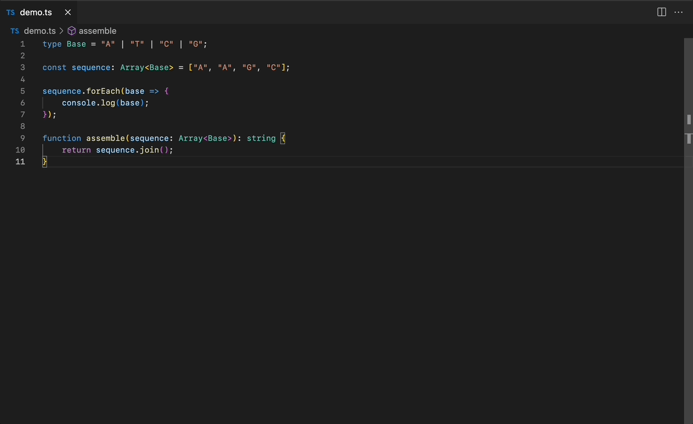

# learnxinyminutes (VS Code Extension)

This extension uses the materials from [learnxinyminutes](https://learnxinyminutes.com/), a site with cheatsheets that can get you quickly up and running in an unfamiliar language. Instead of having to navigate to a browser, the cheatsheets can now be opened directly within VS Code.

The open source repository behind the cheatsheets on [learnxinyminutes](https://learnxinyminutes.com/) can be found at [learnxinyminutes-docs](https://github.com/adambard/learnxinyminutes-docs). As cheatsheets get added and improved, they will be ported into this extension!

## Features

- Searchable cheatsheets
- Automatic and configurable file associations

### Commands

- `LearnXinYMinutes: Open Cheatsheet (auto)`
    - Opens the default cheatsheet for the file type that is active.
- `LearnXinYMinutes: Set File Association`
    - Sets the file type association with a specific cheatsheet
- Coming soon:
    - Command for manually opening cheatsheets

## Extension Settings

- `LearnXinYMinutes: Custom File Associations`
    - Key-value pairs that will override any file associations.
    - (Recommended) Set new associations with the `LearnXinYMinutes: Set File Association` command
- Coming soon:
    - Configure whether the cheat sheet opens as side view, new tab, or new window. 